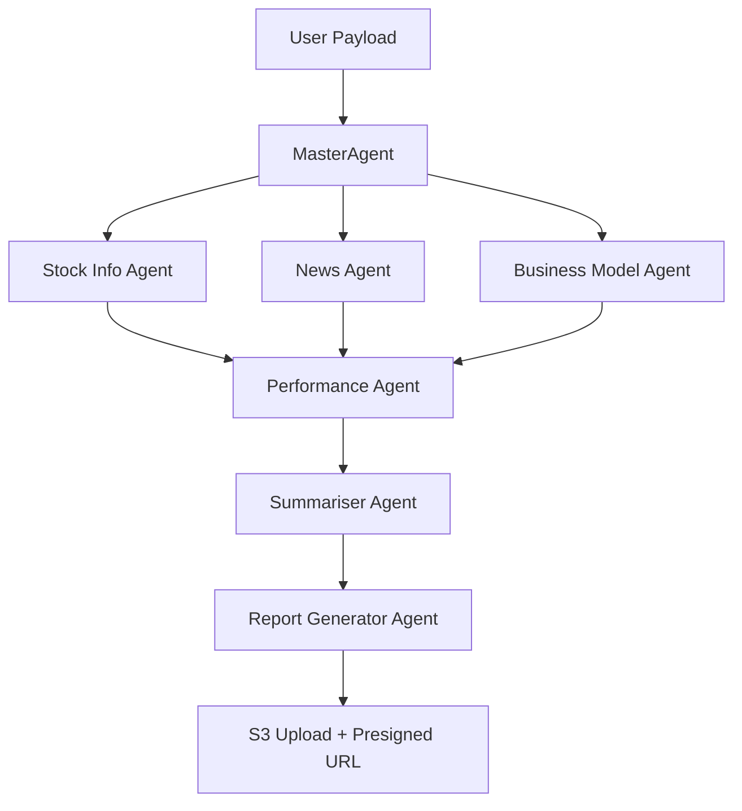

# 📈 StockEquityX - Your Financial Analyst Agent

A comprehensive AI-powered financial analysis system that provides intelligent stock market insights, sentiment analysis, and investment recommendations using AWS Bedrock AgentCore and multi-agent architecture.

## 🎯 What is this?

StockequityX - Your Financial Analyst Agent is an advanced financial analysis platform that leverages multiple AI agents to provide comprehensive stock market analysis. It combines real-time stock data, news sentiment analysis, business model evaluation, and technical analysis to generate detailed investment reports with Buy/Hold/Sell recommendations.

## 🚀 Key Features

- **⚡ Lightning Fast Analysis**: Get stock insights in under 3 minutes
- **🤖 Multi-Agent Architecture**: Specialized AI agents for different analysis tasks
- **📊 Real-time Stock Data**: Integration with Yahoo Finance for current market data
- **📰 Sentiment Analysis**: News aggregation and sentiment evaluation from reliable sources
- **🧩 Business Model Analysis**: Company fundamentals and revenue stream analysis
- **📈 Technical Analysis**: 3-month price trend analysis with volatility metrics
- **💾 Memory System**: Persistent conversation history and user interaction tracking
- **🧾 HTML Report Generation**: Professional financial reports with charts and visualizations
- **💻 Modern Web Interface**: Intuitive Angular-based frontend for seamless user experience
- **☁️ AWS Integration**: Deployed via Bedrock AgentCore + Strands SDK + S3 + Bedrock + Lambda + Cloudfront + Boto3 SDK

## 🛠 Technologies Used

### Core Technologies
- **Python 3.12**: Primary programming language
- **AWS Bedrock**: AI/ML foundation models (Claude 4 Sonnet)
- **AWS BedrockAgentCore**: Agentic Application Deployment
- **AWS S3**: Cloud storage for generated reports
- **Docker**: Containerization for deployment

### AI & Machine Learning
- **Strands Agents SDK**: Multi-agent framework for AI orchestration
- **Bedrock Agent Core**: AWS agent runtime and memory management
- **Claude 4 Sonnet**: Advanced llm model for analysis available in Amazon Bedrock

### Frontend Technologies
- **Angular 20**: Modern JavaScript library for building user interfaces
- **TypeScript**: Type-safe JavaScript development

### Data Sources & APIs
- **Yahoo Finance (yfinance)**: Stock market data and company information
- **DuckDuckGo Search**: News aggregation and web search
- **Pandas**: Data manipulation and analysis

### Additional Libraries
- **boto3**: AWS SDK for Python
- **requests**: HTTP library for API calls
- **python-dotenv**: Environment variable management
- **concurrent.futures**: Parallel processing for agent execution

## 🧩 Architecture



## 🧠 Agents Overview

| Agent                      | Description                                                                       |
| -------------------------- | ---------------------------------------------------------------------             |
| **Master Agent**           | Oversees all sub-agents and manages workflow execution.                           |
| **Stock Info Agent**       | Retrieves real-time equity data from **Yahoo Finance**                            |
| **News Agent**             | Fetches and analyses financial news for sentiment and relevance.                  |
| **Business Model Agent**   | Evaluates company fundamentals and growth levers.                                 |
| **Performance Agent**      | Synthesizes insights to recommend Buy/Hold/Sell actions.                          |
| **Summariser Agent**       | Provide the summary of the stock.                                                 |
| **Report Generator Agent** | Produce interactive dashboard, hosted securely on **AWS S3** with presigned URLs. |


## 📋 Prerequisites

- Python 3.12+
- AWS Account with Bedrock and Bedrock AgentCore access
- Docker (for containerized deployment)
- Valid AWS credentials configured

## ⚙️ Installation & Setup

### 1. Clone the Repository
```bash
git clone <repository-url>
```

### 2. Install Dependencies
```bash
pip install -r requirements.txt
```

### 3. Environment Configuration
Copy the example environment file and configure your settings:
```bash
cp agent_deployment/.env.example agent_deployment/.env
```

Edit the `.env` file with your AWS configuration:
```env
S3_BUCKET=your-s3-bucket-name
AWS_REGION=us-east-1
BEDROCK_MODEL_ID=your-bedrock-model-arn
```

### 4. AWS Configuration
Ensure your AWS credentials are configured:
```bash
aws configure
```

## 🚀 Agent Deployment Script

For automated deployment on Bedrock AgentCore, use the deployment script:

```bash
python agent_deployment_script.py
```

### Deployment Script Features
- Automated Bedrock AgentCore deployment
- Environment validation
- Agent registration and configuration
- Memory Creation
- Runtime setup and initialization
- Health checks and monitoring


## 🔧 Agent Runtime Configuration

### Bedrock Agent Core Setup
The system uses AWS Bedrock Agent Core for runtime management:

```python
from bedrock_agentcore.runtime import BedrockAgentCoreApp

app = BedrockAgentCoreApp()

@app.entrypoint
def strands_agent_bedrock(payload):
    # Agent logic here
    pass

if __name__ == "__main__":
    app.run()
```

### Environment Variables for Deployment
```env
AWS_REGION=us-east-1
S3_BUCKET_NAME=bedrock-agentcore-related-data
BEDROCK_MODEL_ID=us.anthropic.claude-3-7-sonnet-20250219-v1:0
SESSION_ID=financial_agent_analysis_session
```

## 🌐 Frontend Interface

The system features a modern, responsive web interface built with React and TypeScript:

### Key Frontend Features
- **Stock Search**: Real-time stock symbol and company name search
- **Interactive Dashboard**: Clean, intuitive interface for analysis requests
- **Progress Tracking**: Real-time analysis progress with loading indicators
- **Report Viewer**: Embedded HTML report display with download options
- **Responsive Design**: Optimized for desktop, tablet, and mobile devices
- **Error Handling**: User-friendly error messages and retry mechanisms

### Frontend Setup
```bash
cd frontend
npm install
npm start
```

### User Experience
1. **Search**: Type any company name or stock symbol
2. **Select**: Choose from autocomplete suggestions
3. **Analyze**: Click "Get Analysis" button
4. **Wait**: Complete insights delivered in under 3 minutes
5. **Review**: View comprehensive HTML report with all analysis

## 📖 Usage

### Direct Agent Invocation
```python
from agent_deployment.agent import MasterAgent

# Initialize the master agent
master_agent = MasterAgent()

# Run analysis for a stock
result = master_agent.run(
    share_name="Apple Inc",
    ticker_symbol="AAPL",
    ACTOR_ID="user123"
)
```

### API Endpoints

#### Stock Search
```bash
GET /search?_q=Apple
```

#### Financial Analysis
```bash
GET /?stockname=Apple&ticker_symbol=AAPL&actor_id=user123
```

### Response Format
```json
{
  "report": "https://s3-presigned-url-to-html-report"
}
```

## 🏗 Architecture

### Multi-Agent System
1. **Master Agent**: Orchestrates all sub-agents and manages workflow
2. **Performance Agent**: Analyzes stock price trends and generates recommendations
3. **News Agent**: Aggregates and analyzes market sentiment from news sources
4. **Business Model Agent**: Researches company fundamentals and business model
5. **Report Generator Agent**: Creates comprehensive HTML reports
6. **Summarizer Agent**: Generates executive summaries

### Data Flow
```
User Input → Master Agent → [Price, News, Business] Agents → Performance Agent → Report Generation → S3 Storage → Presigned URL Response
```

## 📊 Analysis Components

### Stock Information
- Current price and daily changes
- Market cap, volume, and trading metrics
- 52-week highs/lows and target prices
- Sector and exchange information

### Technical Analysis
- 3-month price trend analysis
- Volatility index calculation
- Percentage change metrics
- Buy/Hold/Sell recommendations

### Sentiment Analysis
- News headline aggregation from reliable sources
- Sentiment scoring (Positive/Negative/Neutral)
- Market sentiment summary

### Business Model Evaluation
- Revenue stream analysis
- Product/service portfolio assessment
- Competitive positioning
- Growth prospects evaluation

## 🔒 Security Features

- AWS IAM-based access control
- Environment variable configuration
- Secure S3 presigned URLs
- No hardcoded credentials

## 📜 Memory System
- The MemoryClient is used to persist the last 5 interactions.
- Each interaction includes timestamp + stock name.
- This enables context-aware recommendations and continuity across sessions.

## 🎨 Report Features

Generated HTML reports include:
- Professional styling with CSS
- Interactive charts and visualizations
- Comprehensive analysis sections
- Historical interaction tracking
- Mobile-responsive design

## 🔧 Configuration Options

### Environment Variables
- `AWS_REGION`: AWS region for services
- `S3_BUCKET_NAME`: S3 bucket for report storage
- `BEDROCK_MODEL_ID`: Bedrock model ARN
- `SESSION_ID`: Agent session identifier

### Customizable Parameters
- Analysis timeframe (default: 3 months)
- News source preferences
- Report styling and format
- Memory retention period

## 🚨 Error Handling

The system includes comprehensive error handling for:
- API rate limiting and timeouts
- Invalid stock symbols
- AWS service failures
- Data parsing errors
- Memory management issues

## 📝 Logging

Structured logging is implemented throughout the system:
- Agent execution tracking
- Performance metrics
- Error reporting
- User interaction logs


## 🆘 Support

For issues and questions:
1. Check the existing issues in the repository
2. Create a new issue with detailed description
3. Include relevant logs and error messages

## 🔮 Future Enhancements

- Real-time streaming data integration
- Advanced charting capabilities
- Portfolio management features
- Mobile application development
- Integration with additional data sources
- Machine learning model improvements

---

**Note**: This system requires valid AWS credentials and appropriate permissions for Bedrock, Bedrock AgentCore, S3, and other AWS services. Ensure compliance with financial data usage regulations in your jurisdiction.


**⚠️ Disclaimer**: **This project was developed as part of a hackathon and is intended solely for demonstration and educational purposes.
Any investment recommendations (Buy/Hold/Sell) provided by this system are AI-generated insights and do not constitute financial advice.
Users should conduct their own research or consult a qualified financial advisor before making any real investment decisions.
The developers, contributors, and hackathon organizers assume no responsibility or liability for any financial losses or actions taken based on this application's outputs.**